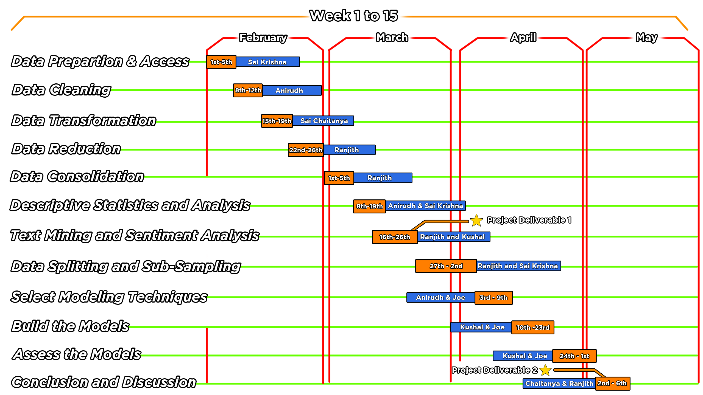

<h1 align="center">Final Report</h1>
<h1 align="center">Automated Categorization of Computer Science Research Papers using NLP and Modelling Techniques</h1>

<h3 align="center">Submitted by: </h3>
<h3 align="center">Sai Krishna Siddana; Anirudh Bommina; Kushal Kulshrestha; Joe Austin Athimala Maria; Ranjith Kumar Kuppu Rathinam; Sai Chaitanya Reddy Kouratla</h3>
<h3 align="center">Guided by : Dr. Bryan Hammer</h3>


<h2>Table of Contents</h2>

  * [Executive Summary](#executive-summary)
  * [Statement of Scope](#statement-of-scope)
    + [Project objectives](#project-objectives)
    + [Variables](#variables)
  * [Meet The Team](#meet-the-team)
  * [Project Schedule](#project-schedule)
  * [Data Preparation](#data-preparation)
    + [Data Access](#data-access)
    + [Data Cleaning](#data-cleaning)
      - [Removing duplicated titles](#removing-duplicated-titles)
      - [Removing Non-CS categories](#removing-non-cs-categories)
      - [Removing the accents](#removing-the-accents)
      - [Removing punctuations](#removing-punctuations)
      - [Removing single alphabet words](#removing-single-alphabet-words)
    + [Data Transformation](#data-transformation)
      - [Removing redundant columns](#removing-redundant-columns)
      - [Changing Data Type](#changing-data-type)
      - [Converted text to lowercase](#converted-text-to-lowercase)
    + [Data Reduction](#data-reduction)
      - [SVD for Data Decomposition](#svd-for-data-decomposition-)
      - [Lemmatization](#lemmatization)
    + [Data Consolidation](#data-consolidation)
    + [Data Dictionary](#data-dictionary)
  * [Descriptive Statistics and Analysis](#descriptive-statistics-and-analysis)
    + [Quantitative measures and summary](#quantitative-measures-and-summary)
    + [Word count analysis](#word-count-analysis)
    + [Top 20 publication dates](#top-20-publication-dates)
    + [Trend in number of publications](#trend-in-number-of-publications)
    + [Quantitative analysis on the authors](#quantitative-analysis-on-the-authors)
    + [Top 20 Authors](#top-20-authors)
    + [Popular categories](#popular-categories)
- [Text Mining and Sentiment Analysis](#text-mining-and-sentiment-analysis)
    + [Topic Analysis](#topic-analysis)
    + [Classification model – base:](#classification-model--base)
    + [Named Entity Recognition](#named-entity-recognition)
- [Data Splitting and Subsampling](#data-splitting-and-subsampling)
    + [Training data](#training-data)
    + [Validation data](#validation-data)
    + [Test data](#test-data)
- [Select Modelling Techniques](#select-modelling-techniques)
- [Build the Models](#build-the-models)
    + [Decision Tree](#decision-tree)
    + [Random Forest](#random-forest)
    + [Support Vector Machine](#support-vector-machine)
- [Assessing the Models](#assessing-the-models)
    + [Accuracy](#accuracy)
    + [Macro average](#macro-average)
    + [Weighted average](#weighted-average)
    + [Strengths and Weaknesses of the various models](#strengths-and-weaknesses-of-the-various-models)
    + [Model Finalization: Random Forest](#model-finalization-random-forest)
- [Conclusion and Discussion](#conclusion-and-discussion)

## Executive Summary: 

The proposed project aims to address the problem of efficiently categorizing large volumes of computer science research papers using natural language processing (NLP) and machine learning (ML) techniques.The increasing volume of research papers in the field of computer science makes it challenging for researchers and industry practitioners to keep up with the latest advancements and discoveries.We got the data from arxiv "https://arxiv.org/abs/2206.04615", did scrapped the data from Kaggle website https://www.kaggle.com/datasets/Cornell-University/arxiv and then converted it into a CSV file to perform operations on it. Automated categorization can help to streamline this process and make it easier to find and access relevant information.The project involved the use of a dataset containing over 3500 research papers from the arXiv repository. The dataset was pre-processed, cleaned, and transformed to prepare it for analysis. Data reduction techniques were used to select only the most relevant data for modeling. Exploratory data analysis (EDA) was conducted to gain insights into the research papers' characteristics and trends in the field of computer science. 

The findings revealed important patterns, such as the dominance of machine learning research, the growth of research papers contributed each year, and the most common words used in abstracts and titles.Based on the EDA findings, we will build 5 models using NLP techniques using Feature Selection techniques such as TF-IDF vs Word2Vec vs Bag of words to automatically categorize research papers into different classes. The various classes were clubbed whenever the relative frequency was less than 3 % for any particular class. Additionally, a couple of pre-trained models were built : Vader and BERT to extract emotions out of the data, as there are no sentiment classes already associated with our existing data. 

The model's performance was evaluated using several metrics, and the results showed that it was highly accurate in predicting the categories of research papers. The project's outcomes and recommendations include the development of an automated categorization model that can help researchers and industry practitioners save time and effort in categorizing research papers. The model can also help in identifying research gaps and trends in the field, leading to new discoveries and innovations. The project's benefits extend to researchers, industry practitioners, policymakers, and other stakeholders in the field of computer science. They can benefit from the model's accurate and efficient categorization of research papers, leading to faster access to relevant information and more informed decision-making. The potential problem or opportunity is the increasing volume of research papers in the field of computer science, which makes it challenging to keep up with the latest advancements and discoveries. The proposed solution addresses this problem by providing an automated categorization model that can help streamline the process and make it easier to find and access relevant information. This project is important as it addresses a critical need in the field of computer science and can have significant implications for research, innovation, and technological advancements. As the field continues to grow and evolve, automated categorization models can help keep pace with the increasing volume of research papers and ensure that researchers and industry practitioners have access to the latest information and discoveries.

## Statement of Scope:
### Project objectives:
* To pre-process the dataset of research papers by employing NLP techniques such as tokenization, stemming, and stop-word removal, to prepare the text data for modeling.
* To develop a classification model using ML algorithms that can accurately categorize research papers into one of the predefined categories listed in the arXiv taxonomy for computer science.
* To evaluate the efficiency and accuracy of the developed system using various performance metrics, such as precision, recall, and F1 score.

### Variables: 
The project will use the following variables:
* Independent Variable: The research papers dataset from the arXiv repository, consisting of over 1.7 million research papers from various academic disciplines.
* Dependent Variable: The automated system for categorizing research papers developed using NLP and ML techniques.
* Control Variables: The categories of research papers from the arXiv taxonomy for computer science and the performance metrics used for evaluating the developed system.
* Unit of Analysis: The individual research papers from the dataset will be categorized using the developed system.
 

The following categories have been identified in Computer science department from [arxiv taxonomy](https://arxiv.org/category_taxonomy)
| Abbreviation | Meaning |
|:---|:---|
| cs.AI  | Artificial Intelligence
| cs.AR  | Hardware Architecture
| cs.CC  | Computational Complexity
| cs.CE  | Computational Engineering, Finance, and Science
| cs.CG  | Computational Geometry
| cs.CL  | Computation and Language
| cs.CR  | Cryptography and Security
| cs.CV  | Computer Vision and Pattern Recognition
| cs.CY  | Computers and Society
| cs.DB  | Databases
| cs.DC  | Distributed, Parallel, and Cluster Computing
| cs.DL  | Digital Libraries
| cs.DM  | Discrete Mathematics
| cs.DS  | Data Structures and Algorithms
| cs.ET  | Emerging Technologies
| cs.FL  | Formal Languages and Automata Theory
| cs.GL  | General Literature
| cs.GR  | Graphics
| cs.GT  | Computer Science and Game Theory
| cs.HC  | Human-Computer Interaction
| cs.IR  | Information Retrieval
| cs.IT  | Information Theory
| cs.LG  | Machine Learning
| cs.LO  | Logic in Computer Science
| cs.MA  | Multiagent Systems
| cs.MM  | Multimedia
| cs.MS  | Mathematical Software
| cs.NA  | Numerical Analysis
| cs.NE  | Neural and Evolutionary Computing
| cs.NI  | Networking and Internet Architecture
| cs.OH  | Other Computer Science
| cs.OS  | Operating Systems
| cs.PF  | Performance
| cs.PL  | Programming Languages
| cs.RO  | Robotics
| cs.SC  | Symbolic Computation
| cs.SD  | Sound
| cs.SE  | Software Engineering
| cs.SI  | Social and Information Networks
| cs.SY  | Systems and Control


## Meet The Team
From the left:

* Sai Krishna Siddana
* Anirudh Bommina
* Kushal Kulshrestha
* Joe Austin Athimala Maria
* Ranjith Kumar Kuppu Rathinam
* Sai Chaitanya Reddy Kouratla


## Project Schedule





## Data Preparation

In this project, data preparation was carried out in two steps: [prepare_dataframe.py](code/prepare_dataframe.py) and [clean_data.py](code/clean_data.py):

* The first step, [prepare_dataframe.py](code/prepare_dataframe.py), involved reading a large JSON file containing metadata about scientific papers from the arXiv preprint server. The script removed irrelevant columns and converted the data into a panda's data frame.
* The second step, [clean_data.py](code/clean_data.py), involved further processing the data to prepare it for machine learning. The script extracted relevant categories from the data, cleaned the text by removing punctuation, stop words, and other non-essential information, and removed duplicate papers. 
* [arxiv-metadata-oai-snapshot_sample.json](data/arxiv-metadata-oai-snapshot_sample.json) is a sample of the original JSON data used in the project. This file was too large to upload to GitHub, so a smaller sample was used instead.

The output of the data preparation steps includes several CSV files. 
* [computer_science_papers_sample.csv](data/computer_science_papers_sample.csv) is a tab-delimited file containing computer science papers, which were extracted from the original JSON data and cleaned using the clean_data.py script.
* [text_data_for_modelling_sample.csv](data/text_data_for_modelling_sample.csv) is another tab-delimited file that contains information about each paper's abstract, title, and categories. This file is specifically designed for use in machine learning models and will be used as training data.
* Finally, [cleaned_data_for_eda_sample.csv](data/cleaned_data_for_eda_sample.csv) is a tab-delimited file that contains papers along with additional information, such as the number of categories the paper belongs to, the number of authors, and the length of the abstract. This file was used in exploratory data analysis (EDA) to better understand the characteristics of the data.

Overall, the above steps were critical in preparing the raw data for machine learning models and exploratory data analysis. By cleaning and formatting the data in a consistent and organized way, the project team was able to move on to the next steps of the project with a solid foundation.

### Data Access

The data was sourced from the ‘arxiv’ Database containing information of over hundreds of thousands of research papers in various fields. Data was available on Kaggle. The sourced arxiv papers were in the form of a large JSON, which was difficult to process. Hence, we used the ‘DASK’ open-source computing framework for extracting the data. DASK offers a high-scale parallel computing environment for handling and processing large data.  

Below is a sample record from our JSON data:

```JSON
{"id":"0704.0001",
"submitter":"Pavel Nadolsky","authors":"C. Bal\\'azs, E. L. Berger, P. M. Nadolsky, C.-P. Yuan",
"title":"Calculation of prompt diphoton production cross sections at Tevatron and\n  LHC energies",
"comments":"37 pages, 15 figures; published version","journal-ref":"Phys.Rev.D76:013009,2007",
"doi":"10.1103/PhysRevD.76.013009","report-no":"ANL-HEP-PR-07-12",
"categories":"hep-ph","license":null,
"abstract":"  A fully differential calculation in perturbative quantum chromodynamics is\npresented for the production of massive photon pairs at hadron colliders. All\nnext-to-leading order perturbative contributions from quark-antiquark,\ngluon-(anti)quark, and gluon-gluon subprocesses are included, as well as\nall-orders resummation of initial-state gluon radiation valid at\nnext-to-next-to-leading logarithmic accuracy. The region of phase space is\nspecified in which the calculation is most reliable. Good agreement is\ndemonstrated with data from the Fermilab Tevatron, and predictions are made for\nmore detailed tests with CDF and DO data. Predictions are shown for\ndistributions of diphoton pairs produced at the energy of the Large Hadron\nCollider (LHC). Distributions of the diphoton pairs from the decay of a Higgs\nboson are contrasted with those produced from QCD processes at the LHC, showing\nthat enhanced sensitivity to the signal can be obtained with judicious\nselection of events.\n",
"versions":[{"version":"v1","created":"Mon, 2 Apr 2007 19:18:42 GMT"},
{"version":"v2","created":"Tue, 24 Jul 2007 20:10:27 GMT"}],
"update_date":"2008-11-26",
"authors_parsed":[["Bal\u00e1zs","C.",""],["Berger","E. L.",""],["Nadolsky","P. M.",""],["Yuan","C. -P.",""]]}
```
First, we divide the data into chunks of 256 MB and process each chunk in one pass. The following code was used:

```Python
records = dd.read_json('data/arxiv-metadata-oai-snapshot.json',  blocksize='256MB') # Reading the JSON in chunks of 256 MB
 
for i in range(records.npartitions):
    print('Processing '+ str(i)+'th partition')
    try:
        partition_data = records.get_partition(i).compute()
    ...
```

For each chunk, we start with filtering out the papers which had 'cs' as one of their categories. This was done by using the regex:

```Python
pattern='[\s\b]cs\.[A-z.]'
```
The second step was to only pull the required columns. Columns like 'comments', 'versions', 'journal-ref' etc were dropped. There were 2 columns that had author info, one of them being parsed and another one being the string. We chose the parsed column called 'authors_parsed', which made it easy for us to distinguish between authors.
The data from all the chunks was collected into a tab delimited CSV. Also, some chunks had to be processed separately due to 'id' column, whose format was changed by arxiv in later years. 
The last step was to format the authors from format like ["Berger","E. L.",""] to *E L Berger*. This was done by concatenating components of the list in the right order


### Data Cleaning
Data cleaning is an essential step in text analytics as it helps to improve the quality and accuracy of the data used for analysis. Text data often contains noise, errors, and inconsistencies that can affect the performance of the analysis. The following are some common data cleaning techniques used in text analytics:
Removing stop words: Stop words are common words like "the," "and," and "is" which don’t add lot of value to our analysis. So we remove it from our text to improve the performance of our analysis.
Below is the summary of the data cleaning steps we undertook.


#### Removing duplicated titles: 
The dataset contains duplicated titles which add redundancy to our data and will not help with the performance of our analysis. So, we removed the duplicated titles.
*Code Snippet:*
```Python
duplicated_rows = dataframe[dataframe[column].duplicated()]
dataframe.drop_duplicates(subset=[column], inplace=True)
```


#### Removing Non-CS categories:
For our analysis, we are considering only papers published under the Computer Science field. So, we removed all the categories which are not in CS category.
*Code Snippet:*
```Python
pattern = r'\bcs\.\w+' 
dataframe[column] = dataframe[column].apply(lambda x: re.findall(pattern, x))
```


#### Removing the accents:
There are many scientific words which are in different languages than English, for example accent words (like 𝑘). So, we converted them to English word (like k)
*Code Snippet:*
```Python
dataframe[column] = dataframe[column].apply(lambda x: unidecode.unidecode(x))
```


#### Removing punctuations: 
Punctuation marks, such as commas and periods, are removed to eliminate noise and improve the consistency of the data.
*Code Snippet:*
```Python
dataframe[column] = dataframe[column].str.replace(patternpunc,' ')
```


#### Removing single alphabet words:
We have removed the words which are single alphabets in the data because they are irrelevant and can lead to lower accuracy in our analysis.
*Code Snippet:*
```Python
dataframe[column] = dataframe[column].apply(lambda x: re.sub(pattern='\b[A-z]\b', repl="", string=x))
```


### Data Transformation
Data transformation is the process of converting raw text data into a format that is suitable for analysis. The following are the data transformation techniques used in this analytics project:


#### Removing redundant columns: 
We have removed the redundant columns from our dataset and only kept the columns which are required for our analysis.


#### Changing Data Type: 
Based on the data, we have made required changes in datatype of the variables.
*Code Snippet:*
```Python
def change_datatpyes(dataframe, int_columns=None,  date_columns=None):
    
    if int_columns:
        for column in int_columns:
            dataframe[column] = pd.to_numeric(dataframe[column])
                
    if date_columns:
        for column in date_columns:
            dataframe[column] = pd.to_datetime(dataframe[column])
    
    return data
```


#### Converted text to lowercase: 
We have transformed all the text into lowercase in our dataset. Changing the text to lowercase will improve the analysis as all the text is in same case.
*Code Snippet:*
```Python
    dataframe[column] = dataframe[column].str.lower()
```


### Data Reduction
Data reduction happened in multiple stages. The first time it happened was while importing the data, where we did not consider the columns that would be used for our analysis.
In the second part, we removed stopwords, punctuations and single-alphabet words (like 'x', 'y'), These have been described in their respective sections.
Lastly, from this dataset, we prepare 2 data: one for which we keep these columns for EDA. The other data would be used for modelling in future. These are the data reduction steps we undertook for modelling data:
1. As we now know that a paper can have up to 7 target categories, we do not need those many for modelling. We choose up to 3 categories for each paper. If it has less than 3 categories, then less than 3 would be considered. Anything above 3 categories would be trimmed to first 3.
The following piece of code extracts individual categories out of the list of categories. If 2nd and 3rd are not available, it fills an empty string in the value
  ```Python
  data['primary_category'] = data['categories'].apply(lambda x:x[0]) 
  data['secondary_category'] = [i[1] if len(i)>1 else '' for i in data['categories']]
  data['tertiary_category'] = [i[2] if len(i)>2 else '' for i in data['categories']]    
  ```
2. Only the columns 'abstract' and 'title' were considered for modelling as they contain all the text information. Other columns like *submitter*, *authors* etc were not considered. This dataset is stored as [modelling data](data/text_data_for_modelling_sample.csv). Again, due to size limits on GitHub, we were not able to push the entire dataset.


There are around 150 words on average in every document. We restricted the word count to 150 in each of the documents. We then took a subset of 20 % of the overall data randomly while still preserving the distribution of the classes.

 

Original distribution

 

Sample distribution

We then grouped the minority classes with less than 3% of the data into a class called “Other”.

#### SVD for Data Decomposition :

* SVD can help reduce the dimensionality of data by decomposing the original matrix into three separate matrices: a left singular matrix, a diagonal matrix, and a right singular matrix.

* The diagonal matrix contains the singular values of the original matrix, which can be thought of as a measure of the importance of each dimension in the data. By retaining only the top-k singular values, where k is a smaller number than the total number of singular values, we can reduce the dimensionality of the data while preserving most of its original information. Here we used the matrix obtained from the “Abstract” column to reduce the data. This is used for modelling to avoid overfitting. 

This stage happened while modelling. We had applied 2 types of feature engineering techniques while working with the text data: Bag-of-words and TF-IDF vectors. These two techniques tend to produce high dimensional and sparse embeddings. For our case, we had more than 70,000 dimensions. Having the model built on this high dimensionality would have multiple issues:
 a. It would not be able to identify the key features that impact the output variable y
 b. It would take long time to train.
 
 Hence, these dimensions were reduced to 50 using truncated SVD (Singular Value Decomposition). Following code was used to do that:
 
 ```python
svd = TruncatedSVD(n_components=50)

# Transforming training, validation and testing dataset
X_train_reduced = svd.fit_transform(X_train)
X_valid_reduced = svd.transform(X_valid)
X_test_reduced = svd.transform(X_test)
 ```


#### Lemmatization:

First, a text lemmatizer was used to extract the core lemma from all the words. Lemmatizer was preferred over stemming as it preserves the actual meaning of the word. The lemmatizer was built on a random sample of the data eliminating all bias, that is discussed above.


### Data Consolidation
For our use case, data was already in the form of a single JSON file. However, due to limitations on RAM size, the data had to be first divided into chunks and then consolidated after removing the non-relevant data (papers that were not related to CS)
This was utilized using both dask and pandas. 
Firstly, the data was read in chunks of 256 MB, as stated in Data Access section. Then, each chunk was filtered for only the data in which 'cs' was in categories. These filtered chunks would be appended to consolidate in a single file.
```Python
records = dd.read_json('data/arxiv-metadata-oai-snapshot.json',  blocksize='256MB') # Reading the JSON in chunks of 256 MB
    
cs_papers_data = pd.DataFrame()  #empty dataframe

for i in range(records.npartitions): # Iterating through all partitions
    print('Processing '+ str(i)+'th partition')
    try:
        partition_data = records.get_partition(i).compute()

        cs_papers_parition_data = filter_cs_papers(partition_data, pattern='[\s\b]cs\.[A-z.]') # Using regex to pull any cs columns

        cs_papers_parition_data.drop(columns=['comments', 'journal-ref', 'doi', 'license', \
                                     'versions', 'authors', 'report-no'], inplace=True, errors='ignore')
        cs_papers_data = cs_papers_data.append(cs_papers_parition_data) # Appending into the dataframe
```
Some of the partitions were processed separately due to the issues with ID column. The format of 'id' column were changed by arxiv, so there were data type issues occurring while calling *compute()* function. Hence the later chunks got processed separately for which data type was defined explicitly.


### Data Dictionary
The dataset contains several variables that provide information about academic works, such as papers or articles.

| Attribute Name | Description | Data Type | Source | Data | Example |
|:---|:---|:---:|:---|:---|:---:|
|ID |	Represents a unique identifier for each record in the dataset |	Integer |	https://www.kaggle.com/datasets/Cornell-University/arxiv | [computer_science_papers_sample.csv](data/computer_science_papers_sample.csv) |	704.0001 |
|Submitter	| Person or entity that submitted the record to the dataset.	| String |	https://www.kaggle.com/datasets/Cornell-University/arxiv	|[computer_science_papers_sample.csv](data/computer_science_papers_sample.csv) | Pavel Nadolsky
| Authors |	The authors of the paper that is described |	String |	 https://www.kaggle.com/datasets/Cornell-University/arxiv | [computer_science_papers_sample.csv](data/computer_science_papers_sample.csv) | 	E. L. Berger, P. M. Nadolsky |
|Title  |	Represents the title of the paper |	String |	https://www.kaggle.com/datasets/Cornell-University/arxiv | [computer_science_papers_sample.csv](data/computer_science_papers_sample.csv) |	Calculation of prompt diphoton production cross sections |
| Categories	| The categories or topics that the paper is related to |	String |	https://www.kaggle.com/datasets/Cornell-University/arxiv | [computer_science_papers_sample.csv](data/computer_science_papers_sample.csv) |	hep-ph |
| Abstract	| Summary of the content of the paper	| String	| https://www.kaggle.com/datasets/Cornell-University/arxiv	| [computer_science_papers_sample.csv](data/computer_science_papers_sample.csv) | A fully differential calculation in perturbative quantum chromodynamics is presented for the production of massive photon pairs at hadron colliders. All next-to-leading order perturbative contributions from quark-antiquark, gluon-(anti)quark, and gluon-gluon subprocesses are included, as well as all-orders resummation of initial-state gluon radiation valid at next-to-next-to-leading logarithmic accuracy.|
| Update_date |	The date when the record was last updated.|	Timestamp |	https://www.kaggle.com/datasets/Cornell-University/arxiv | [computer_science_papers_sample.csv](data/computer_science_papers_sample.csv) |	11/26/2008 |

| Attribute | Name Purpose |
|:---|:---|
| ID | A unique identifier for each record in the dataset that can be used to keep track of each paper's information. |
| Submitter | The person or entity that submitted the record to the dataset. This information can be used to track submissions and their sources. |
| Authors | The names of the authors of each paper can be used to identify the contributors to each research paper and their respective expertise.|
| Title | The title of each paper can provide information on the subject matter being researched and can be used to categorize papers into different fields of study.|
|Categories | The categories or topics that each paper is related to can be used to analyze the frequency of research in different fields of study, and to identify patterns in the growth of specific research areas over time. |
| Abstract | The summary of the content of each paper can provide a brief overview of the research being conducted and can be used to identify keywords that are commonly used in different fields of study. |
| Update_date | The date when each record was last updated can be used to track changes in research over time, and to identify trends in the evolution of different research topics. |

 
## Descriptive Statistics and Analysis

Let's start with the descriptive analysis for the dataset. 

### Quantitative measures and summary

The below table shows us the quantitative measures for the complete dataset:

|                            |     Count     |     Mean          |     Median |     Standard Deviation |     Minimum |     Maximum |     25%   |     75%    |
|----------------------------|---------------|-------------------|------------|------------------------|-------------|-------------|-----------|------------|
|     Number_of_authors      |     252598    |     3.736035      |     3      |     3.210502           |     1       |     445     |     2     |     5      |
|     Number_of_categories   |     252598    |     1.906373      |     2      |     0.75728            |     1       |     7       |     1     |     2      |
|     Title_word_count       |     252598    |     7.874465      |     8      |     2.676336           |     0       |     33      |     6     |     9      |
|     Abstract_word_count    |     252598    |     106.703185    |     105    |     36.787049          |     0       |     345     |     81    |     131    |

* Number of Authors: The "Number_of_authors" variable showcases that, on average, each entry in the dataset is associated with around 3.74 authors. However, there is noticeable variability in the number of authors per entry, with values ranging from 1 to as high as 445. This suggests a wide range of collaboration patterns among the entries, with some having only one author while others involve a large number of contributors.

* Number of Categories: The "Number_of_categories" variable reveals that, on average, each entry is assigned around 1.91 categories. The distribution of categories per entry is relatively concentrated, with a low standard deviation of approximately 0.76. This indicates that the majority of entries have two or fewer categories assigned to them. It's possible that the dataset primarily focuses on a limited number of categories, with some entries falling outside this trend and having more categories associated with them.

* Title Word Count: The "Title_word_count" variable provides insights into the length of the entry titles. On average, the titles consist of approximately 7.87 words. The distribution of word counts exhibits moderate variability, with a standard deviation of around 2.68. The range of title word counts spans from 0 to 33 words. This suggests that while most titles fall within the 6 to 9-word range, there are entries with shorter or longer titles as well, including some with no words at all.

### Word count analysis

Plot shows the frequency of word counts in the Abstract for the whole dataset :


Plot shows the frequency of word counts in the Title for the whole dataset :


### Top 20 publication dates

The below table shows us the Top 20 dates with the maximum number of publications:

| Update_date | Number_of_Publications |
|:-----------:|:----------------------:|
|  2007-05-23 | 2656                   |
|  2008-02-03 | 672                    |
|  2023-03-07 | 576                    |
|  2023-01-18 | 561                    |
|  2023-03-14 | 551                    |
|  2023-01-31 | 547                    |
|  2023-02-28 | 537                    |
|  2022-06-22 | 535                    |
|  2022-09-07 | 528                    |
|  2016-11-17 | 501                    |
|  2022-11-29 | 481                    |
|  2023-02-07 | 480                    |
|  2023-02-21 | 477                    |
|  2022-10-18 | 470                    |
|  2022-11-15 | 469                    |
|  2022-11-22 | 454                    |
|  2022-10-25 | 451                    |
|  2023-02-14 | 436                    |
|  2022-01-19 | 430                    |
|  2022-12-06 | 422                    |


### Trend in number of publications

The bar chart shows the number of publications over the years :

We see a clear trend, the number of publications have increased over the years. In 2002, less than 5,000 papers were published and in the year 2022, more than 70,000 papers were published. 


The bar chart shows the number of publications based on the months :

We do not see any specific trend in the number of publication based on the months. Almost all the months have around similar number of papers published.


The bar chart shows the number of publications based on the Week Days :

This is an interesting chart, as we see that most of the papers are published on the weekdays which makes sense as publishing centeres and universities are not working over the weekends (Saturday and Sunday). Tuesday is the day, when we see the most number of papers published.


### Quantitative analysis on the authors

Quantitative measures for the Authors present in the dataset :

| Authors                | Details  |
|------------------------|----------|
| Count                  | 252598   |
| Unique                 | 130748   |
| Top Author             | Yang  Li |
| Number of Publications | 82       |

### Top 20 Authors

The below table shows us the Top 20 Authors with the maximum number of publications across all the departments :

| Author                 | Number of Publications |
|------------------------|-------|
| Yang    Li             | 82    |
| Yang    Liu            | 73    |
| Ilias    Diakonikolas  | 67    |
| Hao    Wang            | 65    |
| Xin    Wang            | 64    |
| Xi    Chen             | 64    |
| Oliver    Knill        | 61    |
| Krishnendu  Chatterjee | 60    |
| Iasson    Karafyllis   | 59    |
| Yu    Wang             | 57    |
| Scott    Aaronson      | 56    |
| Yu    Zhang            | 55    |
| Jaydip    Sen          | 54    |
| Andris    Ambainis     | 52    |
| Laszlo    Gyongyosi    | 51    |
| Wei    Wang            | 51    |
| Joseph Y.    Halpern   | 51    |
| Haris    Aziz          | 50    |
| Noga    Alon           | 47    |
| Marcus    Hutter       | 47    |

The below graph below shows us the distribution of number of authors for each research paper. As we can see, most of the papers have less than 10 authors, but some of them even had more than 100. In fact the highest number of authors was found to be 445 for one of the papers. The paper is linked [here](https://arxiv.org/abs/2206.04615)


The second one was to find out who the most contributing authors are. We see there are authors above 350 papers. Also we see that some of these are pioneers of AI like Yoshua Bengio


Third point we observe was related to our output variable: categories. We see that a paper can have up to 7 categories tagged, with most of the papers falling at 2 categories. Mean was found to be 1.9


### Popular categories

The blelow graphs gives us the  idea of the most popular categories of work:

The next step is to check for most common categories. We see that LG (Machine Learning) towers over all other categories, indicating that a lot of work is being done in machine learning.


The next point will help us in determining what most common words are after the removal of stopwords. Words like 'data', 'model', 'learning' etc are found to be most common in *abstract*. These words will help our model learn that they are talking about machine learning or artificial intelligence. This also substantiates the above point of the EDA: most of the work in CS department is happening in machine learning


The next is most common words from the titles. Words like 'learning', 'networks' are again common, indicating involvement of machine learning. The word 'based' looks a bit odd here.


Now that we have a clear understadning about the dataas we looked through the quantiative and descriptive analysis, we are ready to peform the sentiment analysis

# Text Mining and Sentiment Analysis: 

Initially, the data was used to create distinct sentiment classes

  

  

The positive sentiment is the majority class in all these analyses. A Vader pretrained model was used to mine all these sentiments in the abstracts. 

For example, take the last 2 records:


We indeed find that it is a positive sentiment talking about what the paper has developed better than the existing literature. Also, it’s a strong argument that’s also very technical and involved the use of some jargon. So, our model did a decent job of mining the sentiment classes. 

We also identify the technical sentiment through this word cloud visualization:


All the top terms used for the technical class talk about the technical advancements and nuances of the paper. 

### Topic Analysis:

We extracted the top 5 topics from the classes overall:


Here we see that the top 5 topics are all containing technical words that fall under the positive class which is the majority class at around 80 %.  This again shows that most papers are highly technical and talk about the advancements and positive improvements brought about by the introduced paper.

### Classification model – base:


We further went on to build a basic random forest classification model to predict the types of papers in the positive sentiment classes that are in the majority. We achieve barely acceptable accuracy. This shows that our model may be overfitting. So, we need to introduce more data for better generalization. So, for our overall modeling process, we use both positive and negative data.

### Named Entity Recognition: 

For our NER process, we found that the abstract text contained no location-based data. We were unable to extract geographic-tagged information. This again makes sense because there is very little geo-info when it comes to highly technical papers.

We were however able to extract the top nouns, verbs, and adjectives from the data as shown below. This again consolidates what we found earlier about the type of data in the majority classes. These nouns, verbs, and adjectives all convey a technical, positive (talks about the advancements of the paper), argumentative (existing methods minuses vs introduced methods positives) approach.

    

## Data Splitting and Subsampling:

The data was split into 3 mutually exclusive and cumulatively exhaustive datasets namely:

1.	*Training data*: This data comprised 60% of the entire dataset. This was used for training the model.
2.	*Validation data*: This was 20% of the entire dataset. This was used to compare models.
3.	*Test Data*: This was again 20% of the entire dataset. This was used to check what the accuracy of the final model will be on the unseen data.

Since the dataset size was reasonably high, we went ahead with a 60-20-20 split. Even though we trained only on 60% of the entire dataset, it gave us a good chunk of data to train on and provided us with the flexibility to keep a reasonable number of records for validation and test respectively.

The validation and test datasets kept at 20% each enabled us to maintain a proper distribution of classes in each dataset. This would help us capture all the nuances of the dataset in each validation and testing dataset.

This provided us with the ability to check for the accuracy of the model with decent confidence.  We also measured the percentage of output classes in each of the datasets and it remains uniform.

The following graphs compare the share of each class in training, validation, and test datasets respectively.
  

#### Training data


#### Validation data


#### Test data


## Select Modelling Techniques  

Since the goal of this project is to perform the classification of research papers into categories, we would want to perform multi-class classification. Multiple approaches will be tried to get the optimal model.

While selecting the modeling techniques, we want to have an exhaustive set of models with different capabilities.

We will choose to build the following classifier models:

* Logistic Regression: 
A linear model. This would help us capture the patterns in the data if it is linearly dependent on the output class. This model has assumptions of linearity of log odds and no multicollinearity.

* Decision Tree: 
This would be able to capture the nuances and non-linear nature of the dataset. This is a robust model that has fewer assumptions.

* Random Forest: A cluster of decision trees. Typically works better than a single decision tree. This also has fewer assumptions on the training data.

* Support Vector Machine: Transforms the data into higher dimensions to easily separate them out. The underlying assumption is that the support vectors, or the points that are used to demarcate the boundary, are separable in higher dimensions.

We were also aligned to using Naïve Bayes Models since they work well with text datasets. But since this dataset has been transformed by using Singular Value Decomposition (SVD), we would not be able to use Naïve Bayes Model.

The abstract column containing text was used for the overall modeling process. This abstract column was fed into a TF-IDF vectorizer. TF-IDF, short for term frequency-inverse document frequency, is a widely used statistical measure that assesses the relevance of a word to a document within a collection of documents. It works by calculating two metrics for each word in a document: the term frequency, which is the number of times a word appears in the document, and the inverse document frequency, which measures how often the word appears across all documents in the collection.

We used TF-IDF  to select the most important terms to include in the models, thus improving their accuracy and performance. This has been further explained in the modeling stage below. 

Code:  
``` Python
# Building the TF-IDF Matrix  
features = out['Abstract_v2'] 
vectorizer = TfidfVectorizer(max_features=2500, min_df=10, max_df=0.8) 
processed_features = vectorizer.fit_transform(features).toarray() 
```

To present an idea, this is a snapshot of the term-by-document matrix:


Our TF-IDF method gives more weightage to the words appearing less frequently in the term-document matrix (Inverse document frequency) and thus selects those terms that are not ubiquitous or commonplace. Thus we ensure proper generalization of our models.
 
Now, coming to the models we talked about above, they would get us the best of all worlds: linearity and non-linearity. They are also easy to model, and easier to interpret, allowing for better generalization and explainability from a business standpoint.

Let us summarize the assumptions of each of these models:

* Logistic Regression assumes a linear relationship between features and the target variable, and normally distributed errors. Here our data is non-linear and textual. Logistic Regression may not converge very well as the maximum likelihood estimates may be infinite. We need to explore this during modeling.

* Decision Tree assumes that data can be split into homogeneous groups based on the features and uses measures of impurity to determine splits. This is a better model than a model that makes assumptions about data patterns. But it may be prone to overfitting.

* Random Forest is an extension of a Decision Tree that uses ensemble learning to combine multiple trees and reduce overfitting. This might be an ideal model. However, it can get computationally expensive depending on the depth of the trees as well as the size of the training data.

* Support Vector Machine assumes that data can be separated by a hyperplane in a higher-dimensional space, that errors are bounded by a margin parameter, and uses a kernel trick for non-linearly separable data. If optimal hyperparameters are not selected, then this model may not perform well on unseen data.

# Build the Models
The text dataset was first processed with 2 types of feature engineering techniques:

* One hot encoding or Bag of Words 
* TF-IDF Vectorization 

There were multiple models that were trained to both of these features respectively: 
* Random Forest 
* Decision Tree 
* Support Vector Machine 
* Logistic regression

The inherent problem in the dataset was class imbalance, meaning that some classes had very few samples compared to others. Hence, the models were processed for class-imbalance using a parameter called 'class_weight' inside the machine learning model itself. For example, the random forest classifier was initialized with 'balanced' class_weight, as shown in the code snippet.

Following code was used:
```Python 
rf = RandomForestClassifier(class_weight='balanced') 
rf.fit(X_train_reduced, y_train) 
y_pred_rf = rf.predict(X_valid_reduced) 
accuracy_rf = accuracy_score(y_valid, y_pred) 
``` 
Logistic regression model was not able to converge even after iterating over the dataset multiple times. We found that random forest on TF-IDF vectors outperformed the other models, providing us with 65% accuracy.

The following are confusion matrices and classification reports for each of the models: 

#### Decision Tree


#### Random Forest


#### Support Vector Machine


Since there are 10 classes in our model, the interpretation of precision, recall and f1-score becomes a bit tedious. However, accuracy can be used to measure the performance of each model and compare them side-by-side. 
We can see that the accuracy of decision tree is 49%, random forest is 65% and that of support vector machine is 63%.  

The way to interpret accuracy is the number of correctly predicted instances of the classes out of all instances. The following diagram is a simple illustration of accuracy for just two classes : Positive and Negative. 


Accuracy = True Positive + True Negative / True Positive + True Negative + False Positive + False Negative

Here the accuracy of 65 % in our random forest model means that our model can predict the correct category 65 out of 100 times. So we chose the model that gives us the best predictability towards our 10 classes.


Moreover, we can look at how good the model is in predicting each class individually. The F-1 score (A weighted combination of both precision and recall) is decent across the classes.

To present a better understanding of the model, we can take a look at the ROC Curve:


This curve plots the True Positive Rate against the False Positive Rate. The best model would be something that maximizes the Area Under the Curve. Here we have 10 curves for 10 classes. The Area Under these Curves all appears decent for all classes.  

# Assessing the Models:

We have different model assessment strategies like F1 Scores, Average, Macro, and Weighted Averages.

The F1 Score is a weighted combination of precision and recall. Precision is prioritized when the False Positives are to be minimized on priority compared to False negatives, whereas Recall can be used when False Negatives are to be minimized on priority.

The F1 Score here is individual for every class because ours is a Multiclass problem. So, the interpretation of these values goes for a toss.

#### Accuracy:
Accuracy is the simplest and most common measure of classification performance and is defined as the proportion of correct predictions (i.e., true positives and true negatives) out of the total number of predictions. 

#### Macro average:
Macro average is a way of computing the average performance across multiple classes, where each class is treated equally. It is calculated by taking the average of the performance metric (e.g., precision, recall, F1-score) for each class separately. Macro average is useful when you want to give equal weight to each class, regardless of the number of examples in each class.

#### Weighted average:
The weighted average is similar to a macro average but takes into account the number of examples in each class. It is calculated by taking the average of the performance metric, weighted by the proportion of examples in each class. This is useful when you want to give more weight to the performance of larger classes, as they may have a greater impact on the overall performance of the model.

Here we are going with accuracy and weighted average as the metrics. The class imbalance in our data is handled by giving equal weights to each class when modeling.


### Strengths and Weaknesses of the various models

| Model | Strengths | Weaknesses |
|-------| ------- | ------------ |
| Logistic Regression | Simple and fast to train, making it suitable for large datasets. It can be easily interpreted, making it useful for understanding the relationships between features and the target variable. It can handle both binary and multi-class classification problems. | It may not perform well when the data is highly nonlinear or when there are many features with complex interactions. It assumes a linear relationship between the features and the target variable, which may not hold in some cases. It may be sensitive to outliers and missing data. |
| Decision Tree | Easy to interpret and visualize, making it useful for understanding the decision-making process. It can handle both categorical and continuous features. It can capture non-linear relationships between features and the target variable. | It is prone to overfitting, especially when the tree is too deep, or the data is noisy. It may not generalize well to new data if the training set is not representative of the population. It may not perform well when there are many features with complex interactions. |
| Random Forest | Less prone to overfitting than decision trees, thanks to the ensemble learning approach that combines multiple trees. It can handle both categorical and continuous features. It can capture non-linear relationships between features and the target variable. | It is more complex and slower to train than decision trees, especially for large datasets. It may not perform well when there are many features with complex interactions. It may be less interpretable than decision trees because of the ensemble approach. |
| Support Vector Machine | Effective for high-dimensional data, such as text data, because it uses a kernel trick to map the data to a higher-dimensional space. It can handle both binary and multi-class classification problems. It is less prone to overfitting than some other models because of the regularization parameter. | It may be slower to train and less scalable than other models, especially for large datasets. It may be sensitive to the choice of kernel function and other hyperparameters, which may require careful tuning. It may be less interpretable than some other models, such as decision trees. |

### Model Finalization: Random Forest

Here we reject the other models and finalize the Random Forest model, because it less prone to overfitting as it is essentially a randomized ensemble of bagged decision trees. We need the model with the best accuracy. Accuracy is a very good metric even though the classes are imbalanced because equal weights were assigned to each class when building the model.

The four key reasons why we selected the Random Forest Model over the others are:

* The model is less prone to overfitting. The computational complexity is offset by taking a sample of the data for modeling. 
* The model had the best accuracy, and the AUC values for all classes were very desirable for this model.
* For our problem, we need a model that can handle the complexity in the features very well, this may include redundant features as well. We have many technical jargons that can’t always be interpreted from a business context without domain expertise, so our model needs to handle these features well, aided by a good feature engineering method like TF-IDF. 
* The Random Forest model also handles non-linear relationships very well and doesn’t make many assumptions about the data, making it flexible. These are all reasons why the model performed the best as well.

# Conclusion and Discussion

In conclusion, the proposed project aimed to address the challenge of categorizing large volumes of computer science research papers using natural language processing (NLP) and machine learning (ML) techniques. The project used a dataset containing over 3,500 research papers from the arXiv repository. The dataset was pre-processed, cleaned, and transformed to prepare it for analysis, and data reduction techniques were used to select only the most relevant data for modeling. Exploratory data analysis (EDA) was conducted to gain insights into the research papers' characteristics and trends in the field of computer science.     

Based on the EDA findings, five models were developed using NLP techniques, using feature selection techniques such as TF-IDF and Bag of Words to categorize research papers into different classes. The models' performance was evaluated using several metrics, and accuracy was used as the fundamental metric for our multi-class model evaluation. The results showed that they were considerably accurate in predicting the categories of research papers. Additionally, 4 iterations of models were built for mining four sets of polarizing emotions (Positive-Negative, Strong-Weak, etc) using the Vader pre-trained model.    

The outcomes and recommendations of the project included the development of an automated categorization model that can help researchers and industry practitioners save time and effort in categorizing research papers. The model can also help in identifying research gaps and trends in the field, leading to new discoveries and innovations. The project's benefits extend to researchers, industry practitioners, policymakers, and other stakeholders in the field of computer science.

Furthermore, the sentiment analysis revealed that the majority of research papers have a positive sentiment and talk about technical advancements, while named entity recognition revealed that the majority of the data contained technical terms exclusive to CS research. We extracted the top Nouns, Verbs, and Adjectives and backed up our findings through the emotions identified by the model as well as the top topics that were extracted as well. Most of the reviews were positive, with positive nouns and adjectives and all topics were technical and had strong arguments.        

Finally, the data was split into training, validation, and test datasets to evaluate the model's accuracy on unseen data. The proposed solution addresses a critical need in the field of computer science and can have significant implications for research, innovation, and technological advancements. As the field continues to grow and evolve, automated categorization models can help keep pace with the increasing volume of research papers and ensure that researchers and industry practitioners have access to the latest information and discoveries
